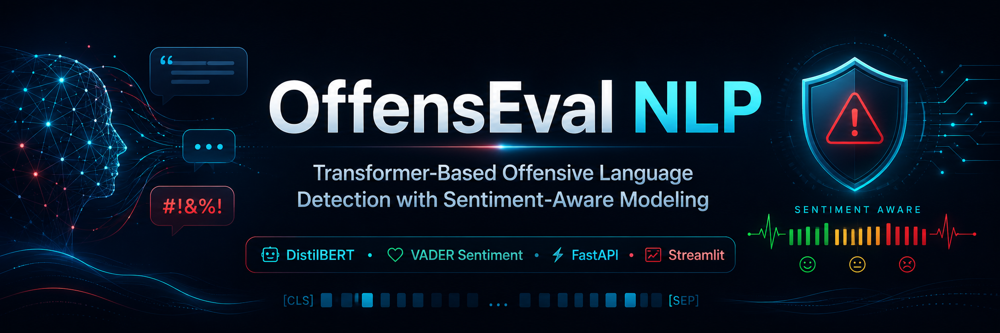

<p align="center">
  
</p>

# 🚨 OffensEval NLP

### Transformer-Based Offensive Language Detection with Sentiment-Aware Modeling

A cloud-deployed NLP application for real-time offensive language detection using **DistilBERT sentence embeddings**, **VADER sentiment features**, and a **Logistic Regression classifier**.

The system is implemented using a production-style architecture with a **FastAPI inference backend**, an interactive **Streamlit frontend**, **Docker containers**, **Azure Container Registry**, and **Azure Container Apps**.

---

## 🌐 Live Application

### Frontend

[https://offenseval-frontend.icysea-bc6cd350.centralindia.azurecontainerapps.io/](https://offenseval-frontend.icysea-bc6cd350.centralindia.azurecontainerapps.io/)

### Backend API Documentation

[https://offenseval-backend.icysea-bc6cd350.centralindia.azurecontainerapps.io/docs](https://offenseval-backend.icysea-bc6cd350.centralindia.azurecontainerapps.io/docs)

### Backend Health Endpoint

[https://offenseval-backend.icysea-bc6cd350.centralindia.azurecontainerapps.io/health](https://offenseval-backend.icysea-bc6cd350.centralindia.azurecontainerapps.io/health)

> The live application provides real-time offensive language classification, confidence scores, cleaned-text visibility, and sentiment-aware output.

---

## 📌 Project Overview

OffensEval NLP is an end-to-end machine learning application designed to identify offensive language in user-provided text.

The project combines transformer-based semantic representations with sentiment information to improve contextual understanding. DistilBERT sentence embeddings are generated through SentenceTransformers, while VADER sentiment scores are added as an additional numerical feature. The combined feature vector is passed to a Logistic Regression classifier for binary prediction.

The application is divided into two independently deployed services:

- A **FastAPI backend** responsible for preprocessing, model loading, sentiment analysis, and prediction
- A **Streamlit frontend** responsible for user interaction and result presentation

Both services are containerized using Docker, stored in Azure Container Registry, and deployed through Azure Container Apps.

---

## 🎯 Key Features

- 🔍 DistilBERT sentence embeddings through SentenceTransformers
- 😊 Sentiment-aware feature augmentation using VADER
- ⚖️ Interpretable Logistic Regression classifier
- 📊 Prediction confidence and sentiment distribution
- 🧹 Centralized text preprocessing
- ⚡ FastAPI REST inference service
- 🌐 Interactive Streamlit frontend
- 🐳 Dockerized frontend and backend
- ☁️ Deployment through Azure Container Apps
- 📦 Container storage through Azure Container Registry
- 🧪 Automated testing with PyTest
- ❤️ Backend health monitoring
- 📁 Modular production-style repository structure

---

## 🏗️ System Architecture

```text
                         User
                           │
                           ▼
                  Streamlit Frontend
                  Azure Container App
                           │
                    HTTPS REST API
                           │
                           ▼
                   FastAPI Backend
                 Azure Container App
                           │
             Text Cleaning and Normalization
                           │
                           ▼
          DistilBERT Sentence Embeddings (768D)
                           │
                   ├───────────────┐
                   │               │
                   ▼               ▼
           Semantic Features   VADER Sentiment
                   │               │
                   └───────┬───────┘
                           ▼
             Feature Concatenation (769D)
                           │
                           ▼
              Logistic Regression Model
                           │
                           ▼
           Prediction, Confidence, Sentiment
````

---

## 🧠 Machine Learning Pipeline

```text
Input Text
   ↓
Text Cleaning and Normalization
   ↓
DistilBERT Sentence Embedding
   ↓
VADER Sentiment Feature
   ↓
Feature Concatenation
   ↓
Logistic Regression Classification
   ↓
Offensive / Not Offensive Prediction
```

### Feature Dimensions

| Component                      | Dimensions |
| ------------------------------ | ---------: |
| DistilBERT sentence embedding  |        768 |
| VADER compound sentiment score |          1 |
| Final feature vector           |        769 |

---

## 🛠️ Technology Stack

| Category             | Technology               |
| -------------------- | ------------------------ |
| Programming Language | Python 3.12              |
| Backend Framework    | FastAPI                  |
| Frontend Framework   | Streamlit                |
| ASGI Server          | Uvicorn                  |
| Machine Learning     | Scikit-learn             |
| Embeddings           | SentenceTransformers     |
| Transformer Model    | DistilBERT               |
| Sentiment Analysis   | VADER                    |
| Validation           | Pydantic                 |
| Testing              | PyTest                   |
| Containerization     | Docker                   |
| Local Orchestration  | Docker Compose           |
| Container Registry   | Azure Container Registry |
| Cloud Deployment     | Azure Container Apps     |
| Version Control      | Git and GitHub           |

---

## 📊 Dataset

* **Dataset:** TweetEval – Offensive Language
* **Task:** Binary text classification
* **Classes:**

  * `Offensive`
  * `Not Offensive`

TweetEval provides benchmark datasets for evaluating language models on social media classification tasks. This project uses the offensive language subset for supervised model development and validation.

---

## 📈 Model Performance

| Metric   | Validation Score |
| -------- | ---------------: |
| Macro F1 |            ~0.72 |
| ROC-AUC  |            ~0.81 |

> The reported values are based on a held-out validation set used during model development.

---

## 🌐 Web Application Features

The Streamlit frontend provides:

* Preprocessed text preview
* Offensive or non-offensive prediction
* Prediction confidence
* VADER compound sentiment score
* Positive, neutral, and negative sentiment percentages
* Sentiment category
* Color-coded sentiment visualizations
* Backend availability check
* Error handling for failed API requests
* Clear usage disclaimer

---

## ⚡ REST API

The FastAPI backend exposes the following endpoints:

| Method | Endpoint   | Description                    |
| ------ | ---------- | ------------------------------ |
| `GET`  | `/`        | API information                |
| `GET`  | `/health`  | Backend and model health check |
| `POST` | `/predict` | Offensive language prediction  |

---

## 📥 Example Prediction Request

```bash
curl -X POST \
  "https://offenseval-backend.icysea-bc6cd350.centralindia.azurecontainerapps.io/predict" \
  -H "Content-Type: application/json" \
  -d '{
    "text": "You are an idiot."
  }'
```

---

## 📤 Example Prediction Response

```json
{
  "prediction": "Offensive",
  "confidence": 0.94,
  "cleaned_text": "you are an idiot",
  "sentiment_score": -0.73,
  "sentiment_category": "Negative",
  "positive_score": 0.0,
  "neutral_score": 0.29,
  "negative_score": 0.71
}
```

> Exact prediction values depend on the trained model and input text.

---

## 📁 Repository Structure

```text
offenseval-nlp/
│
├── assets/
│   └── offenseval-nlp-banner.png
│
├── backend/
│   ├── __init__.py
│   ├── config.py
│   ├── inference.py
│   ├── main.py
│   ├── preprocessing.py
│   └── schemas.py
│
├── frontend/
│   └── app.py
│
├── embeddings/
│   ├── X_train_distil.npy
│   ├── X_val_distil.npy
│   ├── X_test_distil.npy
│   ├── X_train_minilm.npy
│   ├── X_val_minilm.npy
│   ├── X_test_minilm.npy
│   ├── y_train.npy
│   ├── y_val.npy
│   └── y_test.npy
│
├── model/
│   ├── final_model_tuned_distilbert.joblib
│   └── label_encoder.json
│
├── tests/
│   ├── __init__.py
│   ├── pytest.ini
│   ├── test_api.py
│   ├── test_inference.py
│   └── test_preprocessing.py
│
├── Dockerfile.backend
├── Dockerfile.frontend
├── docker-compose.yml
├── requirements.txt
├── Model_Training_and_Evaluation.ipynb
├── .dockerignore
├── .gitignore
├── LICENSE
└── README.md
```

---

## 🚀 Running the Project Locally

### 1. Clone the repository

```bash
git clone https://github.com/ArunavaKumar/offenseval-nlp.git
cd offenseval-nlp
```

### 2. Create a virtual environment

```bash
python -m venv .venv
source .venv/bin/activate
```

For Windows:

```bash
.venv\Scripts\activate
```

### 3. Install dependencies

```bash
pip install --upgrade pip
pip install -r requirements.txt
```

### 4. Start the FastAPI backend

```bash
uvicorn backend.main:app --reload
```

The backend will be available at:

```text
http://127.0.0.1:8000
```

API documentation:

```text
http://127.0.0.1:8000/docs
```

### 5. Start the Streamlit frontend

Open another terminal and run:

```bash
streamlit run frontend/app.py
```

The frontend will usually be available at:

```text
http://localhost:8501
```

---

## 🐳 Running with Docker Compose

Build and start both services:

```bash
docker compose up --build
```

The services will be available at:

| Service               | Local Address                |
| --------------------- | ---------------------------- |
| Streamlit frontend    | `http://localhost:8501`      |
| FastAPI backend       | `http://localhost:8000`      |
| FastAPI documentation | `http://localhost:8000/docs` |

Stop the services with:

```bash
docker compose down
```

---

## 🧪 Automated Testing

Run the complete test suite:

```bash
python -m pytest -v
```

The tests validate:

* Root endpoint availability
* Health endpoint response
* Prediction endpoint response
* Model loading
* Request and response schema compatibility
* Text preprocessing
* Prediction confidence range
* Sentiment score output

---

## ☁️ Azure Deployment Architecture

```text
Local Development
       │
       ▼
Docker Images
       │
       ▼
Azure Container Registry
       │
       ├── offenseval-backend:v1
       │
       └── offenseval-frontend:v1
       │
       ▼
Azure Container Apps Environment
       │
       ├── FastAPI Backend Container App
       │
       └── Streamlit Frontend Container App
       │
       ▼
Public HTTPS Endpoints
```

### Deployed Azure Resources

| Resource                   | Name                  |
| -------------------------- | --------------------- |
| Resource Group             | `offenseval-rg`       |
| Container Registry         | `offensevalacr`       |
| Container Apps Environment | `offenseval-env`      |
| Backend Container App      | `offenseval-backend`  |
| Frontend Container App     | `offenseval-frontend` |
| Azure Region               | Central India         |

---

## 🔄 Deployment Workflow

After modifying the application, rebuild and push the updated Docker image.

### Backend example

```bash
docker build \
  -f Dockerfile.backend \
  -t offensevalacr.azurecr.io/offenseval-backend:v2 \
  .
```

```bash
docker push offensevalacr.azurecr.io/offenseval-backend:v2
```

```bash
az containerapp update \
  --name offenseval-backend \
  --resource-group offenseval-rg \
  --image offensevalacr.azurecr.io/offenseval-backend:v2
```

### Frontend example

```bash
docker build \
  -f Dockerfile.frontend \
  -t offensevalacr.azurecr.io/offenseval-frontend:v2 \
  .
```

```bash
docker push offensevalacr.azurecr.io/offenseval-frontend:v2
```

```bash
az containerapp update \
  --name offenseval-frontend \
  --resource-group offenseval-rg \
  --image offensevalacr.azurecr.io/offenseval-frontend:v2
```

---

## 🩺 Health Monitoring

The backend exposes a health endpoint:

```text
GET /health
```

Example response:

```json
{
  "status": "healthy",
  "model_ready": true
}
```

This endpoint verifies that:

* The FastAPI service is running
* The trained model has loaded successfully
* The backend is ready to accept prediction requests

---

## 🔐 Environment Configuration

The frontend connects to the backend through the `API_URL` environment variable.

Local default:

```text
http://127.0.0.1:8000
```

Azure deployment value:

```text
https://offenseval-backend.icysea-bc6cd350.centralindia.azurecontainerapps.io
```

Example:

```bash
export API_URL=https://offenseval-backend.icysea-bc6cd350.centralindia.azurecontainerapps.io
```

---

## ⚠️ Disclaimer and Limitations

This application predicts offensive language based on patterns learned from social media text.

Known limitations include:

* Sarcasm and humor may be interpreted incorrectly
* Cultural and regional language differences may be missed
* Indirect insults may not always be detected
* Quoted offensive language may be classified without understanding intent
* Very short or ambiguous text may produce uncertain predictions
* Sentiment does not always correspond directly to offensiveness
* Model outputs may reflect biases present in the training data

The application is intended to support content analysis and experimentation. It should not replace human review in high-impact moderation or disciplinary decisions.

---

## 🔮 Future Improvements

* Multi-class toxicity detection
* Hate-speech category classification
* Explainable AI using SHAP or LIME
* Batch prediction endpoint
* Authentication and rate limiting
* GitHub Actions CI/CD
* Azure Monitor and Application Insights
* Structured application logging
* Model version tracking
* Drift monitoring
* Database-backed prediction history
* Kubernetes deployment
* Transformer fine-tuning instead of fixed embeddings

---

## 👨‍💻 Developer

**Arunava Kumar Chakraborty**

*Data Analyst | Machine Learning Enthusiast*

* LinkedIn: [https://www.linkedin.com/in/arunava-kr-chakraborty](https://www.linkedin.com/in/arunava-kr-chakraborty)
* GitHub: [https://github.com/ArunavaKumar](https://github.com/ArunavaKumar)

---

## 📜 License

This project is licensed under the **MIT License**.

See the [`LICENSE`](LICENSE) file for details.

---

## ⭐ Acknowledgements

* Hugging Face
* SentenceTransformers
* DistilBERT
* VADER Sentiment Analysis
* TweetEval
* FastAPI
* Streamlit
* Docker
* Microsoft Azure
